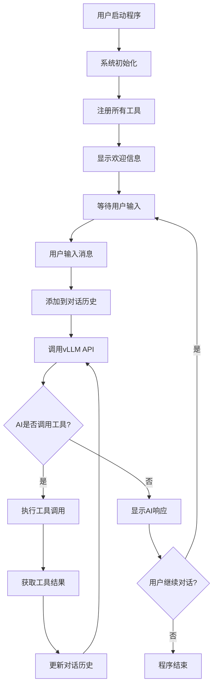
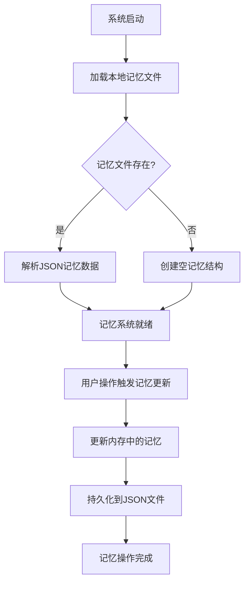

# AI文档生成助手系统架构文档

## 系统概述

这是一个基于Function Calling技术的智能文档生成助手系统，通过对话式交互帮助用户生成各种类型的专业报告文档。系统采用.NET 8.0控制台应用程序架构，集成外部vLLM API服务，实现了工具调用、知识库查询和AI内容生成等核心功能。

## 技术栈

- **开发框架**: .NET 8.0
- **应用类型**: 控制台应用程序(Console Application)
- **AI服务**: vLLM API (Qwen-3-14B模型)
- **数据格式**: JSON序列化/反序列化
- **编程语言**: C# 12.0

## 系统架构

### 整体架构图

```
┌─────────────────┐    ┌──────────────────┐    ┌─────────────────┐
│   用户控制台     │◄──►│  ConsoleApp1     │◄──►│   vLLM API      │
│   (用户交互)     │    │  (核心业务逻辑)   │    │ (AI推理服务)     │
└─────────────────┘    └──────────────────┘    └─────────────────┘
                               │
                               ▼
                       ┌──────────────────┐
                       │   工具库系统      │
                       │ (Tool Library)   │
                       └──────────────────┘
```

### 核心组件

#### 1. 数据结构层 (Data Structures)

**API通信数据结构**:
- `VllmResponse`: vLLM API响应的顶层结构
- `Choice`: API响应中的选择项
- `Message`: 消息对象，包含内容和工具调用
- `ToolCall`: 工具调用请求
- `FunctionCall`: 具体的函数调用信息
- `ToolResultMessage`: 工具执行结果消息

#### 2. 工具系统 (Tool System)

**抽象基类**: `Tool`
- 提供统一的工具接口
- 定义工具的基本属性: Name, Description, Parameters
- 抽象方法: `Execute(string arguments)`
- 模式生成: `GetSchema()` 用于API交互

**具体工具实现**:

| 工具名称 | 功能描述 | 主要用途 |
|---------|---------|---------|
| `ListOutlineTemplatesTool` | 列出所有可用的大纲模板 | 查询可用模板列表 |
| `GetOutlineDetailsTool` | 获取指定模板的详细章节结构 | 展示模板具体内容 |
| `ListNodeTemplatesTool` | 获取指定类型文档的内容模板 | 查询章节内容模板 |
| `GetKnowledgeTool` | 从知识库获取指定项目章节内容 | 知识库内容检索 |
| `GetAIGenerateTool` | 调用AI生成指定内容 | AI内容生成 |
| `SetMemoryTool` | 设置或更新记忆内容 | 记忆存储管理 |
| `GetMemoryTool` | 根据key查询记忆内容 | 记忆检索查询 |
| `ListMemoryTool` | 列出所有记忆键值 | 记忆清单管理 |
| `DeleteMemoryTool` | 删除指定记忆内容 | 记忆清理管理 |

#### 3. 记忆管理系统 (Memory Management System)

**核心功能**:
- **持久化存储**: 将记忆数据保存到本地JSON文件
- **全局变量管理**: 管理 `{currentProjectID}`、`{currentChapterName}` 等全局变量
- **文档状态跟踪**: 记录大纲目录、进度情况和具体内容
- **键值查询**: 支持按key快速检索记忆内容

**记忆存储结构**:
```json
{
  "globalVariables": {
    "currentProjectID": "项目ID值",
    "currentChapterName": "当前章节名称"
  },
  "documentOutline": {
    "chapters": ["章节1", "章节2", "章节3"],
    "template": "使用的模板名称"
  },
  "progress": {
    "completedChapters": ["已完成的章节"],
    "currentStep": "当前步骤描述"
  },
  "documentContent": {
    "chapter1": "第一章具体内容",
    "chapter2": "第二章具体内容"
  },
  "customMemories": {
    "自定义key": "自定义value"
  }
}
```

#### 4. 主程序控制器 (Program Controller)

**核心配置**:
- vLLM API地址: `http://10.10.0.203:8000/v1/chat/completions`
- HTTP客户端: 单例HttpClient用于API通信
- 工具注册: 维护工具库字典和模式列表
- JSON序列化配置: UTF-8编码、宽松转义

**核心方法**:
- `Main()`: 程序入口，初始化并启动交互循环
- `RegisterAllTools()`: 注册所有可用工具
- `CallVllmApi()`: 调用外部AI API
- `handleToolCall()`: 处理工具调用的递归逻辑

## 交互流程

### 用户会话流程



### 工具调用机制

1. **工具调用识别**: AI分析用户需求，决定是否需要调用工具
2. **参数解析**: 解析工具调用的JSON参数
3. **工具执行**: 根据工具名称从工具库中查找并执行
4. **结果处理**: 将工具执行结果添加到对话历史
5. **继续对话**: 基于工具结果再次调用AI API

### 记忆管理流程



### 文档生成工作流

#### 第一阶段：大纲生成
1. 用户表达文档需求
2. **记忆管理**: 调用 `SetMemoryTool` 设置 `currentProjectID`
3. AI引导用户选择或自定义大纲模板
4. 调用 `ListOutlineTemplatesTool` 查看可用模板
5. 调用 `GetOutlineDetailsTool` 获取模板详情
6. **记忆管理**: 保存大纲结构到 `documentOutline`
7. 根据用户需求调整大纲结构

#### 第二阶段：章节内容生成
1. **章节遍历**: 依次生成大纲中的每个章节
2. **记忆管理**: 调用 `SetMemoryTool` 更新 `currentChapterName`
3. **模板匹配**: 调用 `ListNodeTemplatesTool` 查找内容模板
4. **内容处理**: 
   - 直接文本: 直接使用返回的字符串
   - 工具调用: 解析 `Call_XXXTool({参数})` 格式
   - 嵌套调用: 处理多层嵌套的工具调用
5. **变量替换**: 通过 `GetMemoryTool` 查询 `{变量}` 并替换为实际值
6. **内容保存**: 调用 `SetMemoryTool` 保存章节内容到 `documentContent`
7. **进度更新**: 更新 `progress.completedChapters` 列表
8. **用户确认**: 每个章节生成后需要用户确认

## 系统特性

### 优势特点

1. **模块化设计**: 工具系统采用抽象基类设计，易于扩展新功能
2. **对话式交互**: 自然语言交互，用户体验友好
3. **模板化生成**: 内置多种文档模板，提高生成效率
4. **递归工具调用**: 支持复杂的嵌套工具调用场景
5. **知识库集成**: 可以查询项目相关的历史信息
6. **AI增强**: 结合AI生成能力提供智能内容创作
7. **记忆管理**: 持久化存储会话状态和文档生成进度
8. **状态恢复**: 支持断点续写和会话恢复功能

### 技术特色

1. **Function Calling**: 实现了完整的工具调用框架
2. **异步处理**: 使用async/await模式优化API调用性能
3. **错误处理**: 完善的JSON解析和参数验证机制
4. **编码支持**: 完整的UTF-8中文支持
5. **状态管理**: 完整的对话历史追踪

## 配置与部署

### 依赖配置
- **.NET 8.0 Runtime**
- **网络访问**: 需要访问vLLM API服务 (10.10.0.203:8000)
- **控制台环境**: UTF-8编码支持

## 扩展性设计

### 新增工具步骤
1. 继承 `Tool` 抽象类
2. 实现必要的属性和 `Execute` 方法
3. 在 `RegisterAllTools()` 中注册新工具
4. 更新系统提示词以包含新工具的使用说明

## 总结

该系统实现了一个完整的AI驱动文档生成解决方案，通过Function Calling技术将AI推理能力与具体的业务工具相结合，并引入了强大的记忆管理功能，实现了：

1. **状态持久化**: 文档生成过程中的所有关键信息都被保存，支持断点续写
2. **智能变量管理**: 全局变量自动替换，减少重复输入
3. **进度跟踪**: 实时记录文档生成进度，便于管理和恢复
4. **会话恢复**: 系统重启后可以从上次的状态继续工作

系统架构清晰、扩展性强，记忆管理模块的加入使其更加实用和智能，为企业级文档生成提供了可靠的技术基础。 